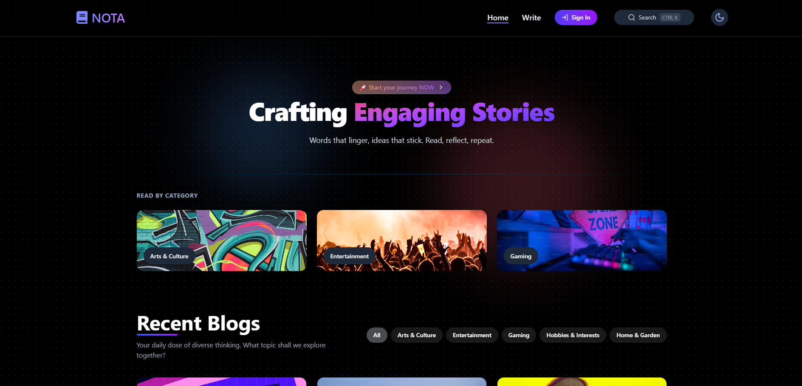
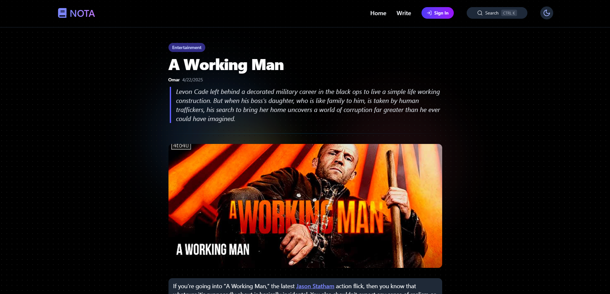
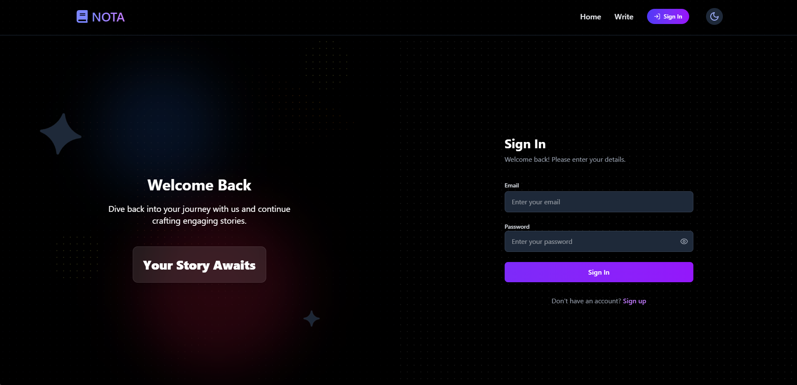

# Nota 📝

Nota is a dynamic and modern blog platform built with React 19 and Firebase. It provides a seamless experience for users to read, create, edit, and manage blog posts, featuring rich content editing, category filtering, tagging, and integrated search.

## ✨ What Nota Offers

*   **Dynamic Homepage Feed:** Displays recent blog posts with infinite scrolling. Users can filter posts by category or browse featured category sections.
*   **Rich Post Viewing:** Presents blog posts with formatted content (via React Quill), cover images, author details, publication dates, categories, and relevant tags. Includes an edit/delete option for authenticated authors.
*   **Intuitive Post Creation:** Authenticated users can create new posts using a rich text editor, upload cover images (via Cloudinary), add tags, select categories, and preview their posts before publishing. Includes client-side validation using Yup.
*   **Seamless Post Editing:** Authors can easily edit their existing posts with a pre-filled form mirroring the creation interface.
*   **Secure Post Deletion:** Authors can delete their posts after a confirmation prompt using a custom modal.
*   **Integrated Search:** A modal-based search allows users to find posts by title prefix or exact tag match, complete with keyboard navigation.
*   **Firebase Authentication:** Secure user signup and login functionality managed by Firebase Auth.
*   **Category System:** Organizes posts by category, allowing users to browse and filter content effectively.
*   **Related Posts:** Suggests similar posts based on the category of the currently viewed article.

## 📸 Screenshots






## 🛠️ Technologies Used

*   **React (v19):** Core UI library for building the user interface.
*   **React Router:** Handles client-side routing and navigation.
*   **TypeScript:** Enhances code quality and developer experience with static typing.
*   **Tailwind CSS:** Utility-first CSS framework for rapid and consistent styling.
*   **Firebase:**
    *   **Firestore:** NoSQL database for storing blog posts, categories, etc.
    *   **Firebase Auth:** Handles user authentication (Email/Password, potentially Google Sign-In).
*   **Cloudinary:** Cloud-based service for managing and delivering image uploads.
*   **Zustand:** State management library (implied by `useAuthStore`).
*   **React Quill:** Rich text editor component for creating blog content.
*   **Yup:** JavaScript schema builder for value parsing and validation.
*   **Framer Motion:** Provides production-ready animations for a smoother UI.
*   **Lucide React:** Library for beautiful and consistent icons.
*   **DOMPurify:** Used for sanitizing HTML content to prevent XSS attacks.
*   **React Toastify:** Displays user-friendly notifications.

## 🚀 Getting Started

### Prerequisites

*   Node.js (LTS version recommended)
*   npm or yarn
*   A Firebase project set up ([Firebase Console](https://console.firebase.google.com/))
    *   Firestore database enabled.
    *   Firebase Authentication enabled (with Email/Password provider).
*   A Cloudinary account ([Cloudinary Website](https://cloudinary.com/))

### Installation

1.  **Clone the repository:**
    ```bash
    git clone https://github.com/Pog-Frog/Nota.git
    ```

2.  **Navigate to the project directory:**
    ```bash
    cd Nota
    ```

3.  **Install dependencies:**
    ```bash
    npm install
    ```

4.  **Set up environment variables:**
    * Copy the `.env.example` file to `.env` and fill in your Firebase and Cloudinary credentials:
  
      ```bash
      cp .env.example .env
      ```

    

### Usage

1.  **Start the development server:**

    ```bash
    npm run dev
    ```
2.  **Open your browser:**
    Navigate to the local URL provided (at `http://localhost:300`).

---